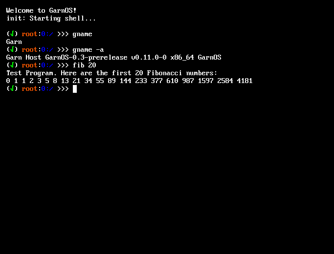

# GarnOS


GarnOS is A Simple, Open-Source, Hobby Operating System.

The main goals of GarnOS are compatibility and modularity.

## Notable Features

- Terminal Emulator
- Module Loader
- Userspace
- Device Manager

# Building & Running

## Dependencies
- GCC and Binutils
- At least a minimum toolset to build a cross-toolchain
- QEMU
- Xorriso (for ISO images)
- Python3 (with kconfiglib installed)
- GNU Parted
- kconfig-frontends
- Doxygen (for docs)
- Git
- make and cmake (cmake is required by mlibc)

## Building

First of all, you need to build the toolchain:
```
make toolchain
``` 

Once you've done that, you must configure the kernel:
```
make menuconfig # curses (less friendly interface)
make xconfig # qt (more friendly interface)
```

Then, in the root directory, run:
```
make all # ISO Image
make all-hdd # HDD Image
```
NOTE: The ISO image will probably not work. Use the HDD image instead!

You may also run the OS directly, as described below, since the `run-*` targets also build the OS in case it hasn't been built already.

## Running
In the root directory, run:
```
make run # Run using ISO Image
make run-hdd # Run using HDD Image
```

You can also run GarnOS in an EFI environment by appending `-uefi` to the commands shown above

For debugging, it is recommended to append `DEBUG=y"` to whatever make command you're using.

# License
See LICENSE for details.

# Milestones

- [x] RTC
- [x] SMP
- [x] APIC, I/O APIC
- [x] Timer
- [x] PCI Driver
- [x] AHCI driver
- [x] IDE driver
- [x] FAT Driver
- [ ] Ext2 Driver
- [x] Userland
- [x] Scheduler
- [x] Processes and Threads
- [x] Syscalls
- [x] libc
- [ ] Driver interface (Custom or UDI)
- [ ] GUI
- [ ] USB Driver
- [ ] Sound
- [ ] Networking

## Known Bugs

- APIC implementation doesn't work properly on some systems.
- Disk access doesnt work properly on "large" drives (> ~512 MiB).
- Disk access is EXTREMELY slow. It's so slow it takes 2-4 seconds to load a simple program such as `ls`.
- AHCI Driver doesn't work on real hardware.
- mlibc sometimes panics when running user programs.

## Support

**General**: PCI \
**Input**: PS/2 Keyboards \
**Storage**: IDE, AHCI \
**File Systems**: FAT32 \
**Graphics**: Standard Graphics


